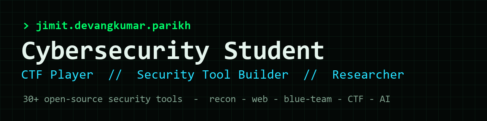

<!-- Profile README for github.com/JIMIT-PARIKH-01 -->



<h1 align="center">Hi, I'm Jimit Devangkumar Parikh 👋</h1>

<p align="center">
  Cybersecurity student · CTF player · builder of <b>30+ open-source security tools</b>.<br>
  Offensive recon → web-app testing → blue-team defense → CTF tooling → applied AI.
</p>

<p align="center">
  <a href="https://www.linkedin.com/in/jimit-devangkumar-parikh/"></a>
  <a href="https://jimit-parikh-01.github.io/Portfolio-Website/"></a>
  <a href="https://github.com/JIMIT-PARIKH-01?tab=repositories"></a>
</p>

---

## 🧰 Security Toolkits

Every toolkit is **pure-Python (stdlib-first)**, ships a **CLI + GUI**, and has
**automated tests running on CI** across Python 3.9–3.12. Click a badge to see it build.

### 🛡️ Blue Team / Defensive
| Tool | What it does |
|---|---|
| **[git-secret-hunter](https://github.com/JIMIT-PARIKH-01/git-secret-hunter)** ⭐ [](https://github.com/JIMIT-PARIKH-01/git-secret-hunter/actions) | Scans a repo's **entire git history** for leaked keys/tokens/passwords — even ones "deleted" from current files. CI-ready. |
| **[blue-team-toolkit](https://github.com/JIMIT-PARIKH-01/blue-team-toolkit)** [](https://github.com/JIMIT-PARIKH-01/blue-team-toolkit/actions) | Log triage, file-integrity monitoring, IOC extraction for incident response. |
| **[threat-intel-toolkit](https://github.com/JIMIT-PARIKH-01/threat-intel-toolkit)** [](https://github.com/JIMIT-PARIKH-01/threat-intel-toolkit/actions) | Phishing-URL scoring (brand-impersonation + typosquat), IOC defanging, hash reputation. |

### 🎯 Offensive / Recon
| Tool | What it does |
|---|---|
| **[recon-suite](https://github.com/JIMIT-PARIKH-01/recon-suite)** [](https://github.com/JIMIT-PARIKH-01/recon-suite/actions) | DNS/port/header recon + security-header grading (incl. COOP/COEP/CORP). |
| **[osint-toolkit](https://github.com/JIMIT-PARIKH-01/osint-toolkit)** [](https://github.com/JIMIT-PARIKH-01/osint-toolkit/actions) | Username/email enumeration, metadata & breach-surface footprinting. |
| **[web-attack-toolkit](https://github.com/JIMIT-PARIKH-01/web-attack-toolkit)** [](https://github.com/JIMIT-PARIKH-01/web-attack-toolkit/actions) | SQLi/XSS probes with multi-DB error fingerprinting (MySQL/MSSQL/Oracle/PG/SQLite). |
| **[netpcap-toolkit](https://github.com/JIMIT-PARIKH-01/netpcap-toolkit)** [](https://github.com/JIMIT-PARIKH-01/netpcap-toolkit/actions) | PCAP parsing & traffic summarisation without heavyweight deps. |

### 🕸️ Web-App Security
| Tool | What it does |
|---|---|
| **[websec-toolkit](https://github.com/JIMIT-PARIKH-01/websec-toolkit)** [](https://github.com/JIMIT-PARIKH-01/websec-toolkit/actions) | Cookie/TLS/CSP auditing and common-misconfig checks. |

### 🚩 CTF
| Tool | What it does |
|---|---|
| **[ctf-crypto-toolkit](https://github.com/JIMIT-PARIKH-01/ctf-crypto-toolkit)** [](https://github.com/JIMIT-PARIKH-01/ctf-crypto-toolkit/actions) | Classic ciphers, 13 codecs (Base85/58/ROT47…), a **magic auto-decoder**, and a 24-format hash identifier. |
| **[ctf-extras-toolkit](https://github.com/JIMIT-PARIKH-01/ctf-extras-toolkit)** [](https://github.com/JIMIT-PARIKH-01/ctf-extras-toolkit/actions) | Stego hints, forensics helpers, and encoding puzzles. |

### 🤖 AI / Automation
| Tool | What it does |
|---|---|
| **[ai-detector-humanizer](https://github.com/JIMIT-PARIKH-01/ai-detector-humanizer)** [](https://github.com/JIMIT-PARIKH-01/ai-detector-humanizer/actions) | Heuristic AI-text detector (%+confidence) and humanizer with before/after diff. |
| **[Commit-only](https://github.com/JIMIT-PARIKH-01/Commit-only)** | Self-healing daily auto-commit tool (GUI + Task Scheduler) with offline-backlog push. |

> ⭐ = flagship · Every ✅ badge is a live CI run on the latest commit.

---

## ⬇️ Get the tools

Every repo has its own **Download & Install** section (clone · ZIP · `pip install git+…`).
**Public tools install freely.** For any **private** tool, access is gated through
GitHub — see **[ACCESS.md](./ACCESS.md)**:

```
request  ->  I approve  ->  GitHub adds you as a collaborator  ->  you can clone/download
```

🔒 Need a private tool? **[Open an access request](https://github.com/JIMIT-PARIKH-01/JIMIT-PARIKH-01/issues/new?template=tool-access-request.md)** or message me on [LinkedIn](https://www.linkedin.com/in/jimit-devangkumar-parikh/) with your GitHub username.

---

## 🧠 Skills


**Focus areas:** offensive recon · web-app pentesting · blue-team/IR · secrets & supply-chain hygiene · CTF cryptography · applied AI.

---

## 📊 GitHub

<p align="center">
  
  
</p>

---

## 📫 Connect

- 💼 **LinkedIn:** [jimit-devangkumar-parikh](https://www.linkedin.com/in/jimit-devangkumar-parikh/)
- 🌐 **Portfolio:** [jimit-parikh-01.github.io/Portfolio-Website](https://jimit-parikh-01.github.io/Portfolio-Website/)
- 🧑‍💻 **All projects:** [github.com/JIMIT-PARIKH-01](https://github.com/JIMIT-PARIKH-01?tab=repositories)

<sub>Building in the open · learning by shipping · one commit at a time.</sub>
